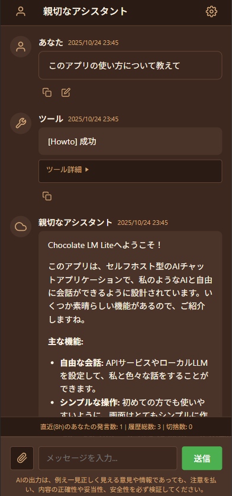

# Chocolate LM Lite 🍫

Chocolate LM Liteは、セルフホスト型のAIチャットアプリケーションです。

「日本語話者が簡単に始められるAPI利用LLM」体験を目指して開発されており、セルフホスト型のソフトウェアです。
各種LLMプロバイダーやローカルLLMと接続して、専門知識のない人にも自由で開かれたAI体験ができることを目指して作成されています。

## [>> 説明書はこちら <<](https://gpsnmeajp.github.io/chocolatelmlitedoc/)
## [>> ダウンロード(Windows) <<](https://github.com/gpsnmeajp/chocolatelmlite/releases/)

  

## 概要

ChatGPTやGemini、Claudeのような一般的なChat AIサービスからすんなりと移行できる使い心地、シンプルな設定、シンプルで必要十分な機能性、日本語、温かさのある外見、容易なセットアップを目指しています。
キャラクターAI利用から、MCPツールなどと連携させての企業内での業務効率化まで幅広く想定した設計です。

OpenRouter経由での利用を想定していますが、OpenAI互換APIであれば何でも利用できるため、GPT, Gemini, Claude, Qwen, Deepseek, Phi... その他各種モデルプロバイダー経由で様々なLLMが利用できます。

自宅PCを簡単にサーバーとして使用し、そのまま使うことも、TailscaleなどのVPN経由でスマートフォンから利用することも想定しています。

## 主な特徴は以下の通りです
- APIサービスやローカルLLMを設定し、自由な対話が可能
- EXEファイルのダブルクリックで起動できる簡単さ (Linuxでは `dotnet run` で実行)
- シンプルな画面で初心者に優しい設計
- 複数の会話ペルソナ(キャラクター)を作成・管理可能(それぞれにシステムプロンプト・モデル・メモリを設定可能)
- タイムスタンプ機能で、時間を考慮した対話が可能
- 自動コンテキストカットオフ機能により、最大長制限なく対話を継続できます
- 仮想スクロール機能で、大量の対話履歴も快適に閲覧可能
- 会話統計機能で、自分がどれだけ会話したか把握可能
- 短時間に大量の会話をした場合、休憩を促すメッセージを表示する機能もあります
- 古い履歴や画像はトークン数節約のため自動的に送信対象から外されます
- メモリ機能で、会話が長引いても重要な情報を保持可能
- Javascriptサンドボックス実行ツールで、正確な計算などが可能
- プロジェクトフォルダ管理機能で、資料を読んだりプログラムを書いたりできます。
- Webhook機能で、AIの発言をDiscordなど外部サービスに転送可能
- タイマーで自発的に発言する機能を搭載
- マルチモーダルLLMによる画像生成機能を備えます
- Model Context Protocolによる外部ツール拡張機能を備え、AIの機能を柔軟に拡張可能
- 定期的な自動アップデートチェック機能を搭載

## 注意
- ご利用の際は、各APIサービスの利用規約を遵守してください。
- 生成されたコンテンツの責任はユーザーにあります。
- 外部ツール呼び出しの際に承認や確認は行いません。
- 標準ツールは安全性を考慮していますが、MCPツールなど外部ツールの利用には注意してください。
- 各種ツールはオンオフおよび各種制限調整が可能です。必要に応じて調整してください。(既定では無効になっている機能もあります)
- LAN内利用が前提であり、インターネット上にパブリックに公開して使用する前提ではありません。

本アプリケーションでは、一般的なAIサービスのような安全機構(ガードレール)は技術的・費用的な理由から実装されていません。  
(これはセルフホスト型のAIアプリケーションでは一般的です)

一般的なAIサービスと異なり、ユーザーが直接LLMプロバイダと契約し、APIキーを取得して料金を支払い使用する必要があります。  
そのため、APIキーの管理や使用に関する責任はユーザーにあり、また各プロバイダの利用規約を遵守する必要があります。  

また、AIが生成するコンテンツには予測不可能な情報、誤情報、有害な情報が含まれることがあります。  
生成物の著作権は利用者が全て得ることができ、一方で、生成物が意図せず著作権や商標を侵害している可能性があります。  
ユーザーは、生成されたコンテンツの内容に対して責任を負い、適切な使用を心がけてください。

**一般的なAI利用に関する留意事項は、総務省のAIリテラシー教育資料 [生成AIはじめの一歩～生成AIの入門的な使い方と注意点～](https://www.soumu.go.jp/use_the_internet_wisely/special/generativeai/) を参照してください。**

## 制約
+ 一度にアクティブにできるのは1ペルソナのみです
+ 権限管理や認証はありません
+ ファイル添付は画像のみ

## 開発環境
C# .Net 8.0

## 動作環境
サーバーとして

- Windows 11
- Ubuntu 24.04

での動作を確認しています。

クライアントとして、

- Windows11 Edge
- Android 16 Chrome

での動作を確認しています。

Mac等でも動作するかと思いますが、動作検証はしていません。

## 推奨LLMプロバイダ(Base URL)
+ [OpenRouter](https://openrouter.ai/) (`https://openrouter.ai/api/v1`) (もっとも推奨, 無料枠あり)
+ LM Studio (`http://127.0.0.1:1234/v1`)
+ Ollama (`http://127.0.0.1:11434/v1`)

※ローカルLLMの場合、APIキーは適当な文字を入れてください。

その他OpenAI互換のエンドポイントを提供するLLMプロバイダであれば動作する見込みです。  
例えば

+ OpenAIは `https://api.openai.com/v1/`
+ Geminiは `https://generativelanguage.googleapis.com/v1beta/openai/`
+ Claudeは `https://api.anthropic.com/v1/`

など。(ただし未検証です。OpenRouterの使用を強く推奨します。)

なお、OpenAI互換のAPIが提供されないLLMプロバイダ(例えばAmazon Bedrock等)の場合、LiteLLM ProxyのようなOpenAI互換APIを提供するプロキシを間に挟むことで動作する可能性があります。

画像生成に関してはOpenRouterのみのサポートです。

## ビルド手順

### Windows

```bash
winget install --id Microsoft.DotNet.SDK.8
dotnet run
```

### Ubuntu

```bash
sudo apt-get install dotnet-sdk-8.0
dotnet run
```

### 利用方法
`http://127.0.0.1:8010` を開いてください。

## LICENSE
MIT License

本ソフトウェアおよび関連する文書のファイル（以下「ソフトウェア」）の複製を取得した全ての人物に対し、以下の条件に従うことを前提に、ソフトウェアを無制限に扱うことを無償で許可します。これには、ソフトウェアの複製を使用、複製、改変、結合、公開、頒布、再許諾、および/または販売する権利、およびソフトウェアを提供する人物に同様の行為を許可する権利が含まれますが、これらに限定されません。

上記の著作権表示および本許諾表示を、ソフトウェアの全ての複製または実質的な部分に記載するものとします。


ソフトウェアは「現状有姿」で提供され、商品性、特定目的への適合性、および権利の非侵害性に関する保証を含むがこれらに限定されず、明示的であるか黙示的であるかを問わず、いかなる種類の保証も行われません。著作者または著作権者は、契約、不法行為、またはその他の行為であるかを問わず、ソフトウェアまたはソフトウェアの使用もしくはその他に取り扱いに起因または関連して生じるいかなる請求、損害賠償、その他の責任について、一切の責任を負いません。